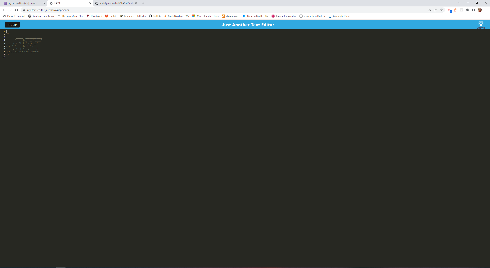

# My Text Editor JATE

---

This project is an example of a progressive web application, PWA, in which users can use as a text editor for writing code. This project uses many technologies, including webpack, babel, javascript, idb, react, and many others

## Requirements

---

```md
AS A developer
I WANT to create notes or code snippets with or without an internet connection
SO THAT I can reliably retrieve them for later use
```

## Acceptance Criteria

```md
GIVEN a text editor web application
WHEN I open my application in my editor
THEN I should see a client server folder structure
WHEN I run `npm run start` from the root directory
THEN I find that my application should start up the backend and serve the client
WHEN I run the text editor application from my terminal
THEN I find that my JavaScript files have been bundled using webpack
WHEN I run my webpack plugins
THEN I find that I have a generated HTML file, service worker, and a manifest file
WHEN I use next-gen JavaScript in my application
THEN I find that the text editor still functions in the browser without errors
WHEN I open the text editor
THEN I find that IndexedDB has immediately created a database storage
WHEN I enter content and subsequently click off of the DOM window
THEN I find that the content in the text editor has been saved with IndexedDB
WHEN I reopen the text editor after closing it
THEN I find that the content in the text editor has been retrieved from our IndexedDB
WHEN I click on the Install button
THEN I download my web application as an icon on my desktop
WHEN I load my web application
THEN I should have a registered service worker using workbox
WHEN I register a service worker
THEN I should have my static assets pre cached upon loading along with subsequent pages and static assets
WHEN I deploy to Heroku
THEN I should have proper build scripts for a webpack application
```

## Usage

---

To use the application, the user must simply navigate to the deployed heroku application, linked below. The user will be greeted with the logo of JATE, and then can start typing. When the user navigates away from the application, their content will automatically be stored into the database, and if it is closed, and reopened, the content that they wrote, will still be there. The user may also install the application onto their desktop by clicking the "Install" button on the top left corner of the screen. The user will then have a shortcut on their desktop to launch the application. If a user wanted to alter the code, they could clone this repository, and when navigating to the application in their terminal, they would need to perform a `md npm install ` command to install the dependencies needed for the application to run properly. If the user looks in the package.json file, they will see any scripts that they might want to run on the application.

## Challenges in Development

---

The biggest issue I had during development, was getting the information that was stored in the database to properly display when the application was launched. This took a while for me to figure out, but with the help of my instructor, I was able to figure it out.

## Screenshot

---



## Deployed Application

---

[Here's the link to the deployed application](https://my-text-editor-jate.herokuapp.com/)

## GitHub Repository

---

[Here's the github repository](https://github.com/brandonelliott0530/Text-editor-pwa)

## Contact Me

---

Please feel free to contact me if you have any questions about this project

Email: brandonelliott0594@gmail.com

GitHub: https://github.com/brandonelliott0530

LinkedIn: https://www.linkedin.com/in/brandon-elliott-751aaa236/
